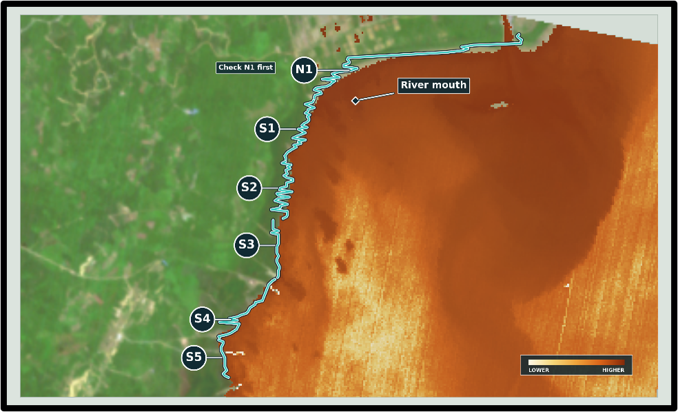

# Coastal Analysis

This project uses a Tanager-1 hyperspectral scene to examine the Sangatta River plume on the Makassar Strait coast of East Kalimantan, Indonesia. It builds evidence from scene screening and spectra through water-quality retrievals, a same-day Sentinel-2 comparison, uncertainty analysis, and a monitoring-oriented CoastCheck capstone. Satellite products are estimates and are not a substitute for co-located field measurements.

## Notebook sequence

1. [`notebooks/01_explore_scene.ipynb`](notebooks/01_explore_scene.ipynb): scene metadata, visual context, and quality screening.
2. [`notebooks/02_spectral_exploration.ipynb`](notebooks/02_spectral_exploration.ipynb): cube inspection, water masking, and spectral evidence for the plume.
3. [`notebooks/03_water_quality.ipynb`](notebooks/03_water_quality.ipynb): relative turbidity, chlorophyll, and CDOM indicators.
4. [`notebooks/04_quantitative_turbidity.ipynb`](notebooks/04_quantitative_turbidity.ipynb): published Dogliotti turbidity retrieval in FNU.
5. [`notebooks/05_ai_water_quality.ipynb`](notebooks/05_ai_water_quality.ipynb): MDN estimates of chlorophyll-a, TSS, and CDOM.
6. [`notebooks/06_sentinel2_acolite_validation.ipynb`](notebooks/06_sentinel2_acolite_validation.ipynb): near-coincident Sentinel-2C and ACOLITE comparison.
7. [`notebooks/07_uncertainty.ipynb`](notebooks/07_uncertainty.ipynb): sensitivity tests, confidence map, and error budget.
- [`notebooks/coastcheck_sangatta.ipynb`](notebooks/coastcheck_sangatta.ipynb): unnumbered CoastCheck capstone for repeat-monitoring priorities.

## Folder map

- `notebooks/` contains the retained analysis sequence and CoastCheck capstone.
- `scripts/inventory.py` crawls the Planet Tanager STAC catalog and writes a local inventory.
- `scripts/download_coastal.py` downloads the Sangatta scene assets and optional HDF5 cubes.
- `scripts/run_mdn_retrieval.py` resamples Tanager reflectance to Sentinel-3 OLCI bands and runs the MDN retrieval.
- `scripts/acolite_sangatta_settings.txt` records the ACOLITE settings used for the Sentinel-2 comparison.
- `scripts/coastcheck_pipeline.py` produces the CoastCheck turbidity comparison, monitoring-zone analysis, figures, and spatial outputs.
- `scripts/coastal_tanager_story.py` is a one-time Tanager-only exploratory evidence pipeline; its shipped GeoJSON outputs support the project data.
- `data/coastal/` holds scene assets and retrieval products. `data/inventory/` holds catalog inventory tables. Other `data/` files provide the capstone's published context and spatial inputs.
- `figures/` contains exported figures, including the cover image above. Intermediate notebook figures use the matching notebook prefix.

## Supporting documents

- [`notebooks/GLOSSARY.md`](notebooks/GLOSSARY.md): terms, units, algorithms, and caveats.
- [`citations.md`](citations.md): deduplicated sources cited by the analysis.
